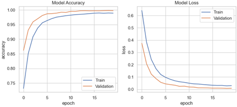
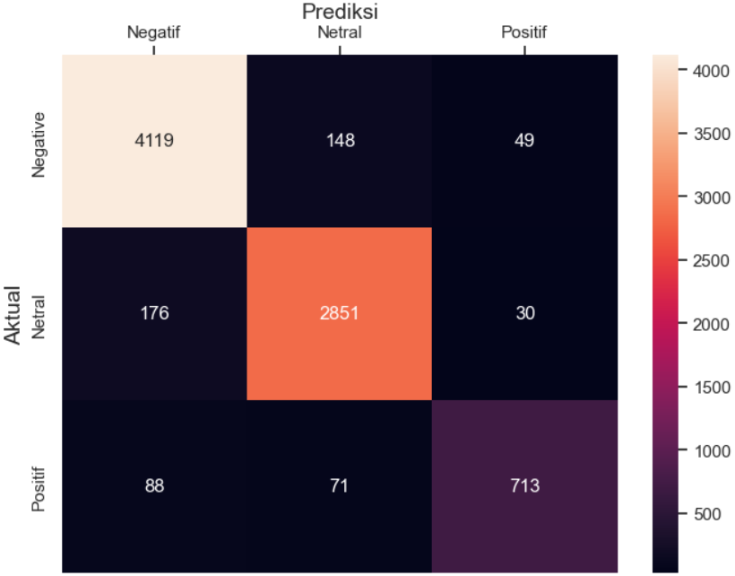
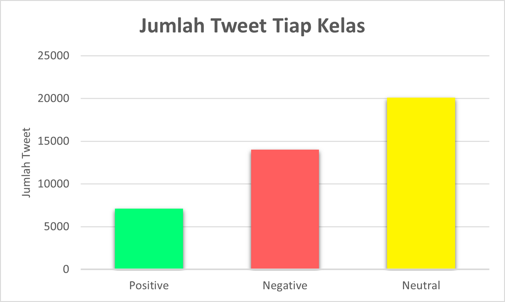
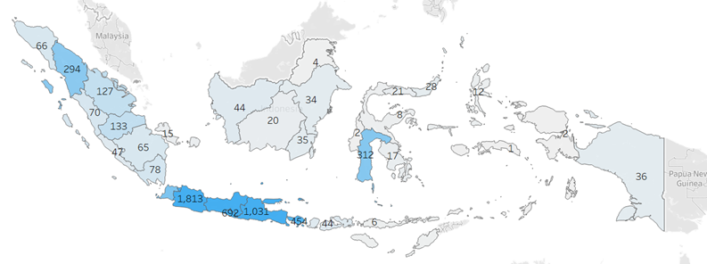

# Sentiment Analysis of Metaverse Tweets using Deep Learning (LSTM)

## Overview

This repository contains code and resources for a sentiment analysis project that analyzes tweets related to the Metaverse using a Long Short-Term Memory (LSTM) model. The project aims to understand public sentiment towards the Metaverse by classifying tweets into positive, negative, or neutral sentiments.

## Table of Contents

- [Background](#background)
- [Dataset](#dataset)
- [Model Architecture](#model-architecture)
- [Requirements](#requirements)
- [Usage](#usage)
- [Results](#results)
- [Contributing](#contributing)
- [License](#license)

## Background

The Metaverse is an emerging concept that encompasses virtual and augmented reality spaces where people can interact, socialize, work, and entertain themselves. Sentiment analysis helps in understanding how people perceive and react to this evolving technology.

## Dataset

The dataset used for this project was collected from Twitter, covering a time range from October 2021 to December 2022. It comprises approximately 86,000 rows and 10 columns, with each row representing a tweet related to the Metaverse. To ensure data quality and consistency for sentiment analysis, the dataset underwent the following preprocessing steps:

1. **Text Cleaning:** The text data in the tweets was cleaned to remove noise and irrelevant information. This involved the removal of hashtags, URLs, mentions, numbers, emojis, punctuation marks, and special characters.

2. **Text Normalization:** Slang and non-standard text were normalized into standard words. This step helps ensure that similar words are treated the same way during analysis, enhancing the accuracy of sentiment classification.

3. **Filtering Stage:** A filtering stage was implemented to eliminate words that do not contribute to the meaning of the text. Common stop words and other irrelevant terms were removed to reduce noise in the dataset.

4. **Stemming:** Words with affixes were stemmed to their basic forms. Stemming helps reduce word variations, ensuring that different forms of the same word are treated as one, which aids in sentiment analysis accuracy.

These preprocessing steps were applied to make the dataset suitable for training and evaluating the sentiment analysis model. The clean and processed dataset was then used to train the LSTM model for sentiment classification.

For detailed information about the dataset preparation and processing, please refer to the code in the project repository, specifically the data preprocessing scripts or notebooks.

## Model Architecture

I employed a Long Short-Term Memory (LSTM) neural network for sentiment analysis. LSTM is a type of recurrent neural network (RNN) that is well-suited for sequence data, making it effective for analyzing text data. The model architecture includes:

- Embedding layer
- LSTM layers
- Fully connected layers
- Softmax activation function

For detailed information about the model architecture and parameters, refer to the code in the [Sentiment Analysis Using Deep Learning (LSTM)](Sentiment%20Analysis%20Using%20Deep%20Learning%20(LSTM).py) file.

## Model Results

### Model Evaluation Metrics

After training and testing the sentiment analysis model on the Metaverse tweet dataset, we achieved the following performance metrics:

- **Accuracy:** 93.50%
- **Precision:** 92.94%
- **Recall:** 90.78%
- **F1-score:** 91.79%

These metrics provide insights into the model's ability to correctly classify tweets into positive, negative, or neutral sentiments.

### Model Evaluation Graphs

We have visualized the model's performance with the following graphs:

1. **Model Accuracy Graph:** This graph shows how the accuracy of the model evolved during training, helping to understand its learning process.
2. **Model Loss Graph:** This graph illustrates the model's loss (error) during training. A decreasing loss indicates improved model performance.

### Confusion Matrix

The confusion matrix provides a detailed breakdown of the model's predictions, showing the number of true positives, true negatives, false positives, and false negatives. It helps assess the model's performance across different sentiment classes.

### Sentiment Distribution

I've visualized the distribution of sentiment classes in the dataset with a bar chart. This chart shows the number of tweets classified as positive, negative, and neutral, providing insights into the overall sentiment distribution.

### Geographic Distribution

To gain geographical insights into tweet distribution, I've created a map of Indonesia displaying the distribution of tweets in each province. This visualization can help identify regions with varying levels of engagement or sentiment.

These visualizations and metrics offer a comprehensive understanding of the sentiment analysis model's performance and the characteristics of the Metaverse-related tweets in our dataset.

## Requirements

To run this project, you'll need the following main dependencies:

- `Python (>=3.6)`
- `TensorFlow (>=2.0)`
- `scikit-learn`
- `Keras`
- `matplotlib`
- `seaborn`
- `pandas`
- `numpy`

You can install these dependencies using `pip` command.

